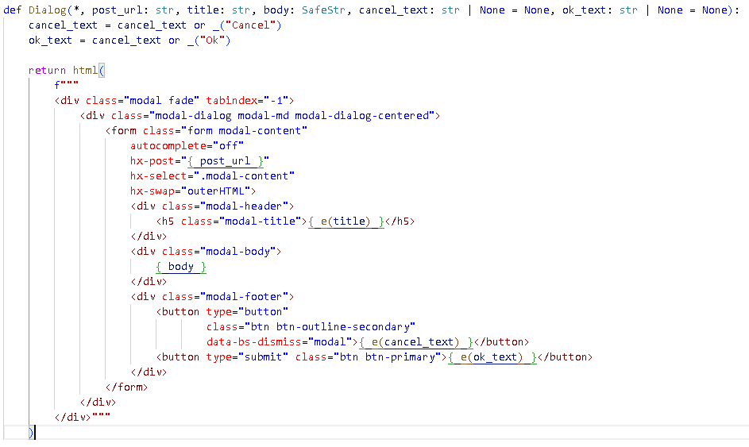

# vscode-python-fstring-dsl

VSCode syntax highlighting for HTML, SQL, JS, CSS in Python f-strings

## Usage

The syntax highlighting is triggered by wrapping the DSL-string in a
specific function call:

- `html(...)`
- `sql(...)`
- `js(...)`
- `css(...)`

This function may be a noop like the Python's `typing.cast()`. Perhaps it could do something useful, e.g. trimming whitespaces or logging.

If the string is the template (f-string), the internal f-expressions will be syntax highlighted too.

## Sample



This sample shows the well-typed server-side Dialog component with
bootsrap styling, htmx magic, and text escaping.

## Configuration

The trigger functions names may be configured to suit your project.
Navigate to **Highlight f-strings** settings in VSCode or edit the settings.json:

```jsonc
"python-fstring-dsl.grammar.triggers": {
    "html": "html|template\\.render", // html or template.render
    "css": "css_\\d", // css_0, css_1, etc
    "sql": false // disable the sql
    // js is not defined, use the default
}
```

The values are regexps. They are inlined inside the larger regexps so don't use capturing groups.

The changes are not applied automatically. Run _(Ctrl-Shift-P)_ **Highlight f-string: Generate grammar** command to regenerate the internal grammar file of extension and reload VSCode.

## More

- The syntax matching is naive. It will work only for the simple common cases. If something don't color the way it should, the best workaround will be the template simplification.

- This extension deals with the highlighting only, so no Intellisence, hovers, etc.

- f-strings are not very useful with CSS and JS. These languages are brace-heavy - too many braces to be escaped.

- Add these lines to the VSCode settings.json to style the f-expression braces italic as in the sample above:

  ```jsonc
  "editor.tokenColorCustomizations": {
          "textMateRules": [
              {
                  "scope": "meta.embedded.inline.f-expression constant.character.format.placeholder.other.python",
                  "settings": {
                      "fontStyle": "italic bold",
                  },
              },
              // ... or maybe underline the full expression ?
              // {
              //     "scope": "meta.embedded.inline.f-expression",
              //     "settings": {
              //         "fontStyle": "underline",
              //     },
              // },
      ]
  },
  ```
